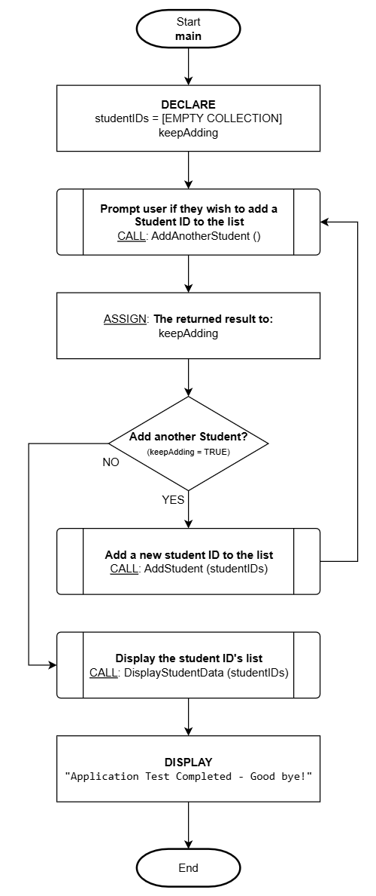

# Data Containers & Collections

## Overview

The simplest form of a data **container** is an array. The concept of an array is a variable capable of storing many values. All programming languages support this simplest form of a container, but many object-oriented languages such as C++, C#, Java, Python, etc., have additional variations mostly referred to as **collections** which provide an additional layer of operations (functions) to help simplify the navigation and management of the data. For the sake of these notes, and to maintain the language-agnostic theme, we will merge the concepts of these two major types of [data representation](./computational-thinking.md#data-representation) as one and refer to it as a **collection** for simplification and consistency.

## Collection Functions

To simplify how to use the functionality of a collection, this section will define a limited list of what features a collection provides so we can refer to this as needed in all future examples.

### Navigation Actions

| Action    | Explanation                                                                                                                                                          |
| --------- | :------------------------------------------------------------------------------------------------------------------------------------------------------------------- |
| **FIRST** | This returns the **first** item in the collection and updates the current position. <br/>If there are no items in the collection, it returns an **EMPTY** item.      |
| **LAST**  | This returns the **last** item in the collection and updates the current position. <br/>If there are no items in the collection, it returns an **EMPTY** item.       |
| **NEXT**  | This returns the **next** item in the collection and updates the current position. <br/>If no more items remain, it returns an **EMPTY** item.                       |
| **PREV**  | This returns the **previous** item in the collection and updates the current position. <br/>If the current item is the first item, it will return an **EMPTY** item. |

**NOTE**: The default current position is assumed to be at the beginning of the list.

### Manipulation Actions

| Action             | Explanation                                                                                                                                                          |
| ------------------ | :------------------------------------------------------------------------------------------------------------------------------------------------------------------- |
| **ADD**            | This will **add (append)** an item to the **end** of the collection <br />and updates the current position. <br />You must provide the new item data as an argument. |
| **DELETE CURRENT** | This will **remove** the **current item** from the collection.                                                                                                       |

:::tip NOTE
To access these actions (functions), you will need to apply the dot `.` operator of the collection variable.
:::

## Collection Declaration

Declaring a collection variable will require you to note it is a **collection type** and must **always initialize it to empty**. This is a good practice but also simplifies how we make the declaration. If we need to create a collection for storing many student ID's, we would declare as follows:

> studentIDs = EMPTY COLLECTION

This notation makes it clear the variable is called `studentIDs` and that it's a collection given it's being set to an **EMPTY COLLECTION**.

## Example Scenario

It is very common for an application to manage information/data that supports many values which may or may not have a known limit to the number of pieces of data to maintain. For example, if an application is required to manage student ID's, we would need the application to be able to adapt to the number of student ID data (which could also involve the adding and removing of students as part of the features of the application).

We certainly would not want to represent each student ID number as a separate variable (such as: `id1`, `id2`, `id3`, etc..) since we would not know how many variables to declare in advance and how would we be able to add more at runtime?

Ideally, we need a way to simplify how we can represent data as a **list**. An important feature for this type of data representation would also include the ability to adapt to changes in the number of list items (expanding or contracting in size). This is where the concept of a collection comes in!

:::tip ONE VARIABLE!
Instead of declaring MANY variables for each student ID (and given the impossibility of how we could even manage varying number of students), we can use a **SINGLE collection variable** to represent many student ID's (as a list)!

We can declare a **single collection variable**: `studentIDs` and by referring to this one variable, we can **access many student ID's**.
:::

Let's define the process for an application to manage the creation and adding of student ID's to a collection variable (where the user can enter as many ID's as desired) with the functionality to display the data stored in the collection after the data is input. We will use a flowchart to orchestrate the main flow and pseudo code to describe the detailed parts accordingly.

## Flowchart

This is the main function and logic flow.



## Pseudo Code

There are three functions to be detailed in this example.

---

**Function**: `AddAnotherStudent()`

```
----------------------------------------------------------------
Description/Purpose:
Prompt the user to confirm if another student ID needs to be entered.

Argument(s) : **NONE**
Return Value: TRUE for "YES"
              FALSE for "NO"
----------------------------------------------------------------

AddAnotherStudent()

1. DECLARE:
      response = FALSE

2. DISPLAY:
      "Do you want to add a student ID?"
      [BUTTON: YES]       [BUTTON: NO]

3. What button was pressed?
      A) YES:
            1) ASSIGN: response = TRUE
      B) NO:
            1) ASSIGN: response = FALSE

4. RETURN: response

5. End
```

---

Function: `AddStudent (studentIDs)`

```
----------------------------------------------------------------
Description/Purpose:
Prompt the user to enter the new student ID and add it to the collection.

Argument(s) : studentIDs (collection variable)
Return Value: Nothing
----------------------------------------------------------------

AddStudent (studentIDs)

1. DECLARE:
      newStudentID

2. DISPLAY:
      "Enter a new student ID:"

3. ASSIGN: newStudentID = [User entered value]

4. studentIDs.ADD(newStudentID)

5. DISPLAY:
      "Student ID added!"

6. End
```

---

Function: `DisplayStudentData (studentIDs)`

```
----------------------------------------------------------------
Description/Purpose:
Display each student ID in the studentIDs collection (iterate/loop).

Argument(s) : studentIDs (collection variable)
Return Value: Nothing

----------------------------------------------------------------

DisplayStudentData (studentIDs)

1. DECLARE:
      tmpID
      itemCount = 0

2. DISPLAY:
      "Here are the stored student ID's:"

3. ASSIGN: tmpID = studentIDs.NEXT

4. Is tmpID empty?
      A) NO:
            1. DISPLAY:
                  "[tmpID]" (newline)
            2. ASSIGN: itemCount + 1
            3. Repeat from step #3

5. DISPLAY:
      "There are [itemCount] Student ID's stored."

6. End
```
