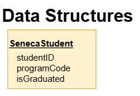
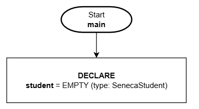
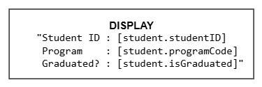
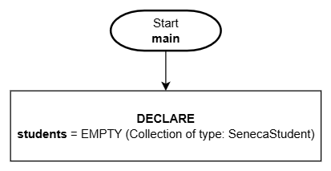
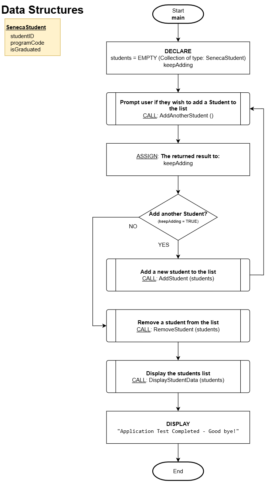

# Data Structures

## Overview

Data structures are an extension of variable types. This is a powerful way to **group related information into a new data type**.

For example, if we want to represent a Seneca Student, we could group all the closely related attributes together into one variable type and make a variable of this new type which would contain all that related information in a single variable. For this example, let's say we want to manage the student ID, program code, and their graduation status.

## Structure DEFINITION:

To define a new data structure, it starts with the new type name and followed by a list of attributes that comprise the new type.

```
[New Data Structure TYPE name]
 - [Attribute 1]
 - [Attribute 2]
 - [Attribute 3]
 - etc.
```

Here's how the Seneca Student type would be defined.

**Pseudo Code**:

```
SenecaStudent
- studentID
- programCode
- isGraduated
```

**Flowchart**:

All data structures would be grouped together in their own dedicated section with each data structure in a separate rectangle.



Creating a new data **TYPE** called `SenecaStudent` will enable us to represent these three attributes of data in a single variable (the student ID, program code, and the graduation status of the student).

:::tip NOTE
The structure **DEFINITION is NOT a variable** - it is only **describing** the attributes that can be managed (represented) for this new type.
:::

## Structure VARIABLE

As mentioned back in the [variables](./variables.md) topic, data **type** information (example: whole number, fractional number, characters etc.) is not supported in all programming languages and so we are maintaining the language agnostic approach and not specifying this level of detail when we declare variables.

**The exception to this rule is for data structures**. To be able to USE a data structure (based on its definition), we must create a variable **including the type** so it will be clear it is not a standard variable.

Using the `SenecaStudent` structure example, this is how we can declare a variable of type **SenecaStudent**:

**Pseudo Code**:

```
DECLARE:
      student = EMPTY (type: SenecaStudent)
```

**Flowchart**:



Now that we have a variable called `student` of type (`SenecaStudent`), we will be able to refer to and assign three related pieces of data using this **single variable**.

## Access Structure Data

Once you have a variable declared that is a structure type, you will need to provide some extra syntax (`.`) to access or refer to the attributes.

Accessing the attributes for the variable `student` from our previous example (recall, `student` is of type **SenecaStudent**), here is how we would display the three attributes.

**Pseudo Code**:

```
DISPLAY:
      "Student ID: [student.studentID]
       Program   : [student.programCode]
       Graduated?: [student.isGraduated]"
```

**Flowchart**:



:::tip FYI
The dot (`.`) syntax is very common among most programming languages to access sub-components of an object.
:::

## Collection of Structures

Now that we have the ability to create structures to better contain related data - let's look at how you can have a collection of structures. In the above examples, we have a single student represented in a variable named "student". What if we want to manage many students? Just as we did in the introduction to [collections](./data-collections.md), we can specify a collection of a new type `SenecaStudent`.

**Pseudo Code**:

```
DECLARE:
      students = EMPTY (Collection of type: SenecaStudent)
```

**Flowchart**:



## Example - Putting it all together!

Here is an example of putting it all together where we will support **adding, removing, and displaying** the data for a collection of `SenecaStudent` data.

### Flowchart

This is the main function and logic flow.



---

### Pseudo Code

First we will define the `SenecaStudent` data structure and then the four detailed functions needed in this example.

```
----------------------------------------------------------------
Data Structures:

SenecaStudent
- studentID
- programCode
- isGraduated

----------------------------------------------------------------
```

---

**Function**: `AddAnotherStudent()`

```
----------------------------------------------------------------
Description/Purpose:
Prompt the user to confirm if another student needs to be entered.

Argument(s) : **NONE**
Return Value: TRUE for "YES"
              FALSE for "NO"
----------------------------------------------------------------

AddAnotherStudent()

1. DECLARE:
      response = FALSE

2. DISPLAY:
      "Do you want to add a student?"
      [BUTTON: YES]     [BUTTON: NO]

3. What button was pressed?
      A) YES:
            1) ASSIGN: response = TRUE
      B) NO:
            1) ASSIGN: response = FALSE

4. RETURN: response

5. End
```

---

Function: `AddStudent (students)`

```
----------------------------------------------------------------
Description/Purpose:
Prompt the user to enter the new student data and add it to
the collection.

Argument(s) : students (Collection of type: SenecaStudent)
Return Value: Nothing
----------------------------------------------------------------

AddStudent (students)

1. DECLARE:
      newStudent (Type: SenecaStudent)

2. DISPLAY:
      "Enter a student ID:"

3. ASSIGN: newStudent.studentID = [User entered value]

4. DISPLAY:
      "Enter the program code:"

5. ASSIGN: newStudent.programCode = [User entered value]

6. DISPLAY:
      "Has the student graduated (YES|NO)?:"

7. ASSIGN: newStudent.isGraduated = [User entered value]

8. ADD the new student to the collection: students.ADD(newStudent)

9. DISPLAY:
      "Student added!"

10. End
```

---

Function: `RemoveStudentData (students)`

```
----------------------------------------------------------------
Description/Purpose:
Removes a student from the students collection where it matches
on the user-entered student ID.

Argument(s) : students (Collection of type: SenecaStudent)
Return Value: Nothing

----------------------------------------------------------------

RemoveStudentData (students)

1. DECLARE:
      tmpStudent
      tmpID
      foundMatch = FALSE
      keepLooking = TRUE

2. DISPLAY:
      "Enter the studentID of the student to remove:"

3. ASSIGN: tmpID = [User entered value]

4. Continue searching the collection? (keepLooking = TRUE)
      A) YES:
            1. ASSIGN: tmpStudent = NEXT: item from students
            2. Is tmpStudent empty?
                  A) NO:
                        1. Does the entered ID match this student? (tmpStudent.StudentID = tmpID)
                              A) YES:
                                    1. REMOVE the current student item: students.DELETE
                                    2. ASSIGN: foundMatch = TRUE
                                    3. ASSIGN: keepLooking = FALSE
                  B) YES:
                        1. ASSIGN: keepLooking = FALSE

            3. Repeat from step #4

5. Was a match found (and student data deleted)? (matchFound = TRUE)
      A) YES:
            1. DISPLAY
                  "Student has been removed from the list!"
      B) NO:
            1. DISPLAY:
                  "Student could not be found."

6. End
```

---

Function: `DisplayStudentData (students)`

```
----------------------------------------------------------------
Description/Purpose:
Display each student in the students collection (iterate/loop).

Argument(s) : students (Collection of type: SenecaStudent)
Return Value: Nothing

----------------------------------------------------------------

DisplayStudentData (students)

1. DECLARE:
      tmpStudent
      itemCount = 0

2. DISPLAY:
      "Here are the stored students:"

3. ASSIGN: tmpStudent = students.NEXT

4. Is tmpStudent empty?
      A) NO:
            1. DISPLAY:
                 "Student ID: [tmpStudent.studentID]
                  Program   : [tmpStudent.programCode]
                  Graduated?: [tmpStudent.isGraduated]" (newline)
            2. ASSIGN: itemCount + 1
            3. Repeat from step #3

5. DISPLAY:
      "There are [itemCount] Student's stored."

6. End
```
