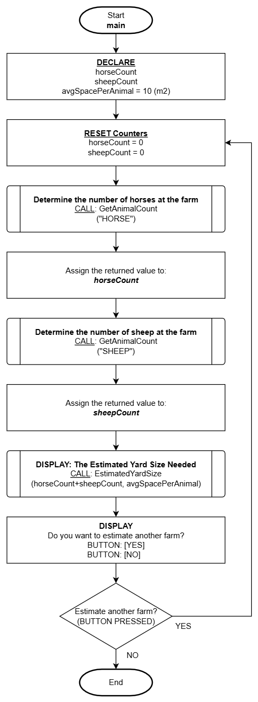

# Documenting Logic

## Overview

The previous section on [computational thinking](./computational-thinking.md) focused on the computational thinking model and how it applies to the problem solving process. Now, lets focus on how we will **document and communicate logic**.

There are many possible ways to document and communicate algorithms, however these notes will be focused on two very popular methods:

1. Flowchart
2. Pseudo Code

:::info NOTE
For the purposes of these notes, we'll be using flowcharts to communicate a simplified view of an algorithm and pseudo code for communicating the details of an algorithm.
:::

It was stated in the [introduction](./intro.md) to these notes, we will not be concerned with any specific programming language syntax (language agnostic) and will be focused primarily on the logic.

In staying with this theme and to establish **consistency and clear program-language agnostic communication** of algorithms, a minimal set of **guidelines** will need to be applied for each of these methods.

## Flowchart

Flowcharts are highly visual as they are constructed with graphical symbols to represent information and process flows (algorithms) in a more **simplified view**.

Flowcharts are much more challenging to construct for complex detailed algorithms given the intensive application of graphical components - it can sometimes take more time to arrange the graphical symbols than it did to create the entire algorithm!

Flowcharts are used primarily for two purposes:

1. **To illustrate technical algorithms to non-technical persons.**
   - Flowcharts are a great way to communicate algorithms and technical information to non-technical persons who are not programmers or those who only need to have an overview of the algorithm and not the lower-level details.
2. **For technical persons to view detailed algorithms from a different perspective**
   - Technical persons like programmers will often use flowcharting to view a smaller more specific part of an algorithm to better understand it from a different perspective and to better "visualize" it. This often sparks more creative ways to address logic.
   - **Note**: Flowcharts with detailed algorithms is outside the scope of these notes and will not be covered.

Given these notes will be focused on **purpose #1**, this will limit a solution to having only one flowchart providing a simplified outline of the **main algorithm** needed to solve a problem. The flowchart will be an abstraction of the overall solution providing enough information to non-technical persons of the intent and major logic flows of the solution.

### Graphical Symbols

Flowcharts are actually standardized by the International Organization for Standardization [ISO](https://www.iso.org/home.html) and depending on the sector/field of discipline and type of information you are using flowcharts for, will have its own set of standardized symbols that should be used. Overall there is an extensive library of symbols representing very specific meaning and should be used when appropriate.

To stay within the scope of these notes, a very limited set of the most common symbols will be used:
| Symbol-Image | Symbol-Shape | Description |
| ------------ | ------------ | ----------- |
|  | Squashed Oval | **Start** of the algorithm |
|  | Squashed Oval | **End** of the algorithm |
|  | Rectangle | **Simple process** or action |
| | Striped Rectangle | **Complex function** <br /> (a pseudo code function or a closed-box process) |
| | Diamond | **Decision** (change in logical flow) |
| | Text Label | **Text to describe decision output flow** <br />(placed on top of the line) |
| | Lines with Arrows | **Flow direction** used to join symbols <br /> (indicates the next symbol to execute) |

### Simple Example

Throughout the notes as programming logic is introduced, detailed examples applying the guidelines will be provided. In the meantime, here's a simple example to give you some idea of what flowcharting is about.



## Pseudo Code

Pseudo code is a programmer's go-to choice for documenting algorithms. This is because of how flexible it is to modify and reorganize logic which is a very common activity when creating algorithms. Unlike flowcharts which is graphical, **pseudo code is textual and describes logic with concise clear human-language (English in this case)**. It is also easy to copy/paste the content directly into your code file to work from.

"Pseudo" meaning not genuine or false, indicates this type of describing logic is not genuine code (staying true to our rule of not programming in any specific language). Pseudo code can be more technical than flowcharts, but does not use any programming language specific syntax, but instead, **describes the logical intent at the level programmers can use to program the logic to any programming language desired**.

Pseudo code can be constructed in many different ways and generally we all have our own stylistic way of doing it but as mentioned in the overview, there will be some guidelines applied for the sake of consistency and clear communication. The guidelines described in these notes are minimal but effective general rules that are a good base to work from while you eventually establish your own style.

### General Guidelines

| Guideline          | Description                                                                                                                                                                                                                                            |
| ------------------ | :----------------------------------------------------------------------------------------------------------------------------------------------------------------------------------------------------------------------------------------------------- |
| Enumeration        | Each step or instruction should have a corresponding sequence number or letter. When nested logic is applied, enumeration resets using the opposite number or letter sequence.                                                                         |
| Indentation        | The term nesting will be explained later, but it is crucial to consistently indent (or `TAB`) each level of logic that is nested.                                                                                                                      |
| Alignment          | Overall horizontal left-alignment is critical to keeping statements organized and easily identifiable as to which each statement is related to or apart of other parts of logic (especially when nesting).                                             |
| Flow-through Logic | Logic should flow naturally to the next step. You should not have instructions that state "continue to the next step" as this is the natural sequence when one statement ends, it automatically assumes to continue to the next statement in sequence. |
| Jump Statements    | Logic flow needs to be carefully managed and NEVER apply "jump statements" which direct logic to jump ahead skipping many steps. Example: if step #5 instructs "GO TO step #99" this is extremely poor design and not acceptable!                      |

### Simple Example

As mentioned in the flowchart section, throughout the notes as programming logic is introduced, detailed examples applying the guidelines will be provided. In the meantime, here's a simple example to give you some idea of what pseudo coding is about.

This example has two functions defined that were referenced from the preceding flowchart example above.

```
Function: GetAnimalCount(animalType)

1. DECLARE:
            count = 0

2. DISPLAY:
            "Tap the [ADD 1] button to add 1 to the counter or
             [DONE] when you are finished counting

             <animalType> Count:<count>  BUTTON: [ADD 1]
                                         BUTTON: [DONE]"

3. Which button was tapped?
    ADD 1:
           a) Add 1 to count
           b) Repeat from step:2

    DONE :
          a) DISPLAY:
                      "Are you sure?
                       BUTTON: [YES]
                       BUTTON: [NO]"
          b) Which button was tapped?
              NO:
                  1. Repeat from step:2

    NONE :
          a) Repeat from step:2

4. Return count
5. END
```

```
Function: EstimatedYardSize(totalAnimals, spacePerAnimal)

1. DECLARE:
         feedTrough = 3
         waterTrough = 6
         estAnimalSpace = <totalAnimals> * <spacePerAnimal>

2. DISPLAY:
         "Do you need a feeding trough?
          BUTTON: [YES]
          BUTTON: [NO]"

3. Which button was tapped?
    NO:
        a) feedTrough = 0

4. DISPLAY:
         "Do you need a water trough?
          BUTTON: [YES]
          BUTTON: [NO]"

5. Which button was tapped?
    NO:
        a) waterTrough = 0

6. DISPLAY:
         "Total Animals    : <totalAnimals>
          Est. Animal Space: <estAnimalSpace> m2
          Feed Trough      : <feedTrough>
          water Trough     : <waterTrough>
          ----------------------------------------
          Total Estimate   : <estAnimalSpace> + <feedTrough> + <waterTrough>"

7. END
```
