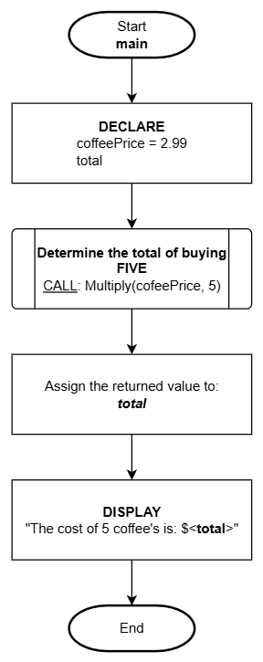
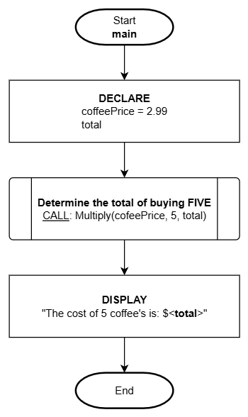
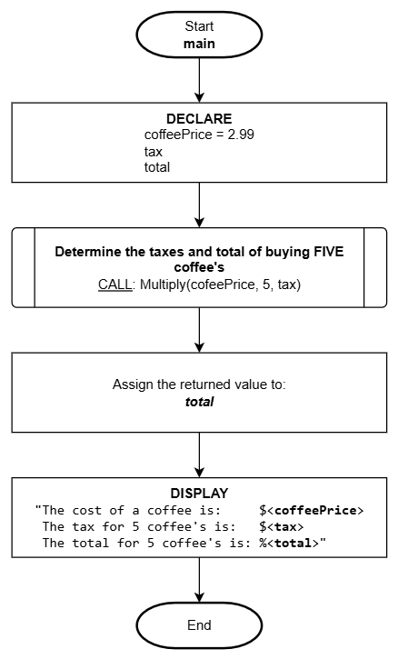

# Modularity with Functions

## Overview

<!--
Introduce functions and closed-boxes.
-->

Modularity is an important aspect of programming as it provides flexibility in orchestrating logic needed for efficient reusability and efficient management of solution components. The most common component of modularity is the use of **functions**.

Functions represent algorithms comprised of several logical steps which perform a specific task. Functions are defined **once and in one place**. This is what makes it efficient and simpler to manage since modifications and trouble shooting bugs directs you to a single source.

When it's time to construct a complete solution, it is nice to be able to reference functions which do all the work (hiding the details) and simplifies the overall readability of the instructions so long as good naming practices have been applied.

Sometimes access to the composition of a function may not be possible. When you don't have access to the details of a function we refer to this as a **closed-box**.

:::tip Reminder
As mentioned in the [Computational Thinking](./computational-thinking.md) sections on:

- [Decomposition](./computational-thinking.md#decomposition): Functions are mostly identified when going through the process of breaking things down into smaller logical parts.

- [Pattern Recognition](./computational-thinking.md#pattern-recognition): Is another area where functions may be identified where you can extract a common piece of logic that can be reused in multiple places throughout the solution.

- [Abstraction](./computational-thinking.md#abstraction): Usually based on a pattern of functions where the concept is the same and can be combined to simplify the usability of a single function.
  :::

## Function Identifiers (name)

Similarly, as variable identifiers should be well thought out and purposefully named to best describe the information it will be representing, so should the function naming process. **Variables are related to DATA**, but **functions are related to ACTION**. Therefore, **function identifiers should be well thought out and purposefully named to best describe their logical purpose and action**. Providing meaningful names to functions will contribute towards easier to read and manage logic (or code).

Reading logic that is applying functions should be like reading a standard sentence or close to it. There should be no mystery of WHAT the function's purpose is based on it's name however, like in variable naming practices, we need to be mindful of efficiency as we don't want to be referring to excessively long names (and in the case of programming code, we don't want to be typing them either!). That being said, unlike variable naming, function names can be a little longer given the importance of having the name best represent WHAT it does so we don't want to over abbreviate.

For example, if we need a function to write program data to a file in JSON format we could create a function with the following signature:

- Function: `WriteDataJSON (data)`
- Parameter: `data` is what will be written to file in JSON format
- Returns: TRUE (success) or FALSE (fail)

Here's an excerpt of how it would be called:

```
1. DECLARE:
      data
      result

2. -> 99. [ logic capturing a lot of information stored to 'data' ]

100. ASSIGN: result = WriteDataJSON (data)
101. Was the data successfully exported to a file?
      A. result=TRUE:
            1. DISPLAY:
                  "Data exported to JSON file!"
      B. result=FALSE:
            1. DISPLAY:
                  "FAILED to write to file."
102. End
```

Now let's consider a poorly named function that writes data to a JSON formatted file. If we replaced the name with `FormatDataJSON (data)`. While not totally incorrect, it does not reveal the fact that data is written to a file which the term "Write" successfully conveys. Another poor name would be `StoreData (data)` - this does not reveal the formatting standard used to save the data and the term **Store** can also refer to variables not files.

:::danger DON'T DO THIS
**Do NOT obfuscate** function names as this renders them meaningless to the logic if you can't easily understand a functions purpose based on the name alone:

- a (data)
- HorseGoat (data)
- abcdef (data)

These functions are not usable since we don't know what their purpose is based on their names!
:::

## Closed-Boxes

There will be times when we need to use 3rd-party logic (known as **API's** : Application Programming Interface) or other prepared logic from **system library functions** where we **don't have access to the details of how they work**.

These functions are known as "**closed-boxes**" (formerly "black boxes"). Closed-box functions are like "magic" because you call them and they do what you expect without explicitly knowing how it performed the task. It is important to note, sometimes this can be a problem because if there is a bug (error) or a missing piece of functionality in that piece of logic, there is nothing you can do to address it other than to redefine your own version of that logic in your own composed function.

:::tip How-To
If you are calling a closed-box function from a flowchart, use the [striped rectangle symbol](./documenting-logic.md#graphical-symbols) to represent a complex function.
:::

## High-Level Functions

High-level functions are usually highly abstracted in that they can represent a lot of functionality/logic usually because this type of function will call many other functions to complete its task. This is like seeing the solution from "a birds eye view".

One such function that is commonly required in many programming languages is "**main**" which behaves as the entry-point to the application (or where the logic begins and typically ends).

:::caution note
For the purposes of these notes, we'll be designating a **`flowchart` to always represent this higher-level view of the overall solution**. The directive of a flowchart is to describe an overall set of instructions in a simple to understand format for non-technical persons, so it is a natural and suitable application of a flowchart.
:::

## Low-Level Functions

Unlike high-level functions, lower-level functions are a lot more focused and detailed on a task that is highly limited in scope - most functions fit this category and are constructed to be reusable or to remove complexity from other larger scoped functions.

:::caution note
For the purposes of these notes, we'll be designating **`pseudo code` to always represent these lower-level detailed parts of the solution algorithm**.
:::

## Passing Information

Functions usually require information to be provided or sent to it to do its task. When a function requires information, it is constructed with one or more **parameters**. Parameter is a fancy term used that essentially means a variable.

For example, if we create a function that is responsible for displaying the date and time in a standard ISO 8601 format (YYYY-MM-DD HH:MM:SS), the function would require all six of those specific parts of data to be supplied:

```
DisplayDateTime (year, month, day, hour, minute, second)
```

The comma delimited list of the date and time parts are the **parameters**. The parameters act as variables which can be used in the function logic to access the values sent to the function.

When it comes time to use this function, we will **CALL** it and supply the function with the information it requires (we call this "passing" data to a function) in the form of **arguments**. An argument is a value sent to a function.

Since the `DisplayDateTime` function has **six parameters**, we will need to send **six arguments** in the order it is expecting it:

```
CALL: DisplayDateTime (2025, 10, 25, 11, 53, 45)
```


Each argument sent to the function will be assigned to the corresponding parameter variable and then the function would construct the output assembling the variables into their appropriate sequence:

```
year-month-day hour:minute:second
```

The expected outcome of this function call, would be to display the date time data as:

```
2025-10-25 11:53:45
```

## Returning Information

Functions often do more than just an explicit task - it is quite common for information to be returned to the caller of the function (ex: back to where the function was called from). Most programming languages support flexible methods in how information can be returned from a function:

1. Explicit
2. Implicit
3. Both explicit and implicit

Let's have a look at these methods and how they will be documented in pseudo code.

:::tip Reminder
Since these notes will be limiting the use of flowcharts to the `main` overview process only, we won't need to concern ourselves with documenting return values for flowcharting.
:::

<!--
Explain how to return data from a function in two possible ways:

1. Explicitly using "return"
2. Implicitly using the argument variables

-->

### Explicit Return

Returning information from a function **explicitly** is accomplished by using the keyword: **`return`**. This method provides a **single variable of information** to be returned from the function.

For example, if we have a function: **`Multiply (number, multiple)`** which will return the results of multplying the provided `number` by the provided `multiple`, the logic would look like the following:

```
Function: Multiply (number, multiple)

1. DECLARE:
      result

2. ASSIGN: result = number * multiple

3. RETURN result

4. End
```

This can be refined by not creating a variable:

```
Function: Multiply (number, multiple)

1. RETURN number * multiple

2. End
```

Here is how the function can be used from a **flowchart**:



Here is how the function can be used from **pseudo code**:

```
Function: main

1. DECLARE:
      coffeePrice = 2.99
      total

2. ASSIGN: total = CALL: Multiply(coffeePrice, 5)

3. DISPLAY:
      "The cost of 5 coffee's is: $<total>"

4. End
```

### Implicit Return

Returning information implicitly involves updating a parameter variable. The understanding with this method is that any changes made to a parameter variable will directly affect the original. This can simplify how return values are documented but also can lead to missed data changes since it is not as clear.

Let's do another version of the preceding example using this method (**notice the extra parameter `total`**).

```
Function: Multiply (number, multiple, total)

1. ASSIGN: total = number * multiple

2. End
```

The `total` parameter variable was used as the return value from the function by assigning the result of the calculation to that variable.

Here is how the function can be used from a **flowchart**:



Here is how the function can be used from **pseudo code**:

```
Function: main

1. DECLARE:
      coffeePrice = 2.99
      total

2. CALL: Multiply(coffeePrice, 5, total)

3. DISPLAY:
      "The cost of 5 coffee's is: $<total>"

4. End
```

The advantage of implicit returns is it is not limited to a single variable return value like the explicit method. The **implicit method, can return multiple values through more than one parameter variable**!

:::tip Note
Some programming languages refer to implicit return values through parameters as:

- output parameters
- pointers
- references
  :::

### Both Explicit AND Implicit Returns

A combination of explicit and implicit methods can be done too! Expanding on the preceding examples, we will add a tax component. The calculated tax amount will be returned implicitly via the tax parameter and the total (including tax) will be returned explicitly:

```
Function: Multiply (number, multiple, tax)

1. DECLARE:
      result
      taxPercent = 0.13

2. ASSIGN: tax  = number * multiple
3. ASSIGN: result = number * multiple + tax

4. RETURN <result>

5. End
```

Here is how the function can be used from a **flowchart**:



Here is how the function can be used from **pseudo code**:

```
Function: main

1. DECLARE:
      coffeePrice = 2.99
      tax
      total

2. ASSIGN: total = CALL: Multiply(coffeePrice, 5, tax)

3. DISPLAY:
      "The cost of a coffee is:     $<coffeePrice>
       The tax for 5 coffee's is:   $<tax>
       The total for 5 coffee's is: %<total>"

4. End
```

:::danger WARNING
As you can see in this example, it can be easy to "miss" how the `tax` is assigned because it is IMPLICITLY updated by the function.
:::
