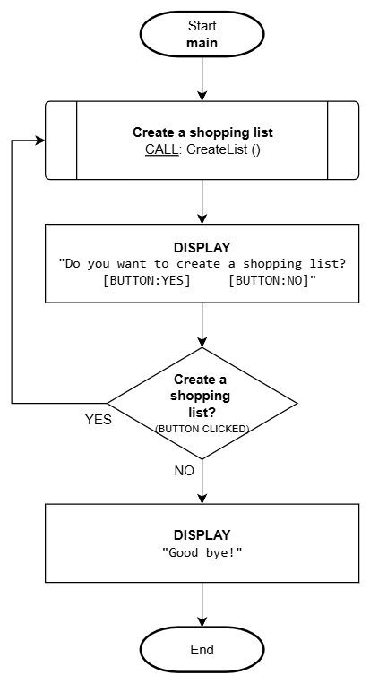
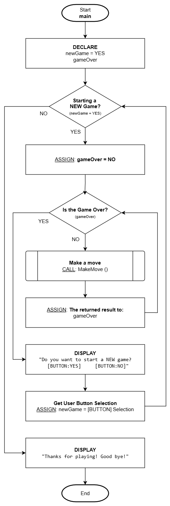

# Iteration

## Overview

It is very common to have to repeat logic, but as we know from the computational thinking model ([pattern recognition](./computational-thinking.md#pattern-recognition)) approach, placing detailed logic into a function when we know it will be reused or repeated is a good practice, but is it enough?

Let's say we need logic to manage a list of items for a shopping list. We would need repeating logic responsible for getting the user input detail for an item and then add each item to the shopping list (this would be a good use of a function), but how many items will there be? Will a shopping list always have the same number of items? Probably not! We can't limit the logic to sequence a set number of calls to the function that adds a list item because that would be a pretty useless application (what if you want fewer or more?)!

The problem is **how to structure the repeating logic** so it can be executed **any number of times (if at all)** and yet **refer to the logic only ONCE**. This is where the **iteration (looping) construct** comes in!

To manage a varying possible number of repetitions (iterations/loops), we must apply **iteration constructs**. There are many forms of these constructs in specific programming languages, but the abstraction (idea/concept) itself is the same with only minor semantic differences. These notes will be focused on the pure concept of iterating (looping) covering two forms:

1. Optional Iteration
2. Mandatory Iteration

## Optional Iteration


Optional iteration is the most common. This involves **checking a condition BEFORE** the possible repeating logic to determine if looping is even required and if so, iterate **until no more iterations are required**. This could result in:

- No iterations
- One iteration
- Many iterations
- Possible infinite iterations

:::tip Technical Insight
**DISCLAIMER**: Something to note about iteration constructs, is that all forms can be made to work like the others however each one has its designed intentions.

Optional iteration found in most programming languages include:

- `while`
- `for`
- `foreach`

**NOTE**: These are language-specific terms and will not be used in the documentation of logic in these notes.
:::

### Flowchart

Let's continue with the shopping list theme from the introduction. We want to create an application that will allow a user to create as many shopping lists as they want - if any. This will involve iteration since the user can make many lists but we don't know how many. **Because this logic approach is optional-based, this means it is possible a shopping list may never be created or many may be created**.

> **NOTE**: To help with this example, we will be using a [**closed-box function**](./functions.md#closed-boxes) to deal with the details of creating a shopping list where items are added to a list. Here's an overview of the function:
>
> - **Name**: **`CreateList ()`**
> - This function prompts the user to enter as many items as they wish to a shopping list.
> - The function logic details will be described in the pseudocode section example.


### Pseudocode

> **NOTE**: We will be using a [**closed-box function**](./functions.md#closed-boxes) that will deal with the details of obtaining item information and adding it to a list of items. Here's an overview of the function:
>
> - **Name and parameter**: **`AddItem (itemList)`**
> - **itemList**: Parameter represents the entire shopping list and will implicitly add an item to that list

Function: `CreateList()`

```
----------------------------------------------------------------
Description/Purpose:
  Demonstration of optional iteration where zero or more shopping
  items can be added to the list.

Argument(s) : NONE
Return Value: NONE
----------------------------------------------------------------

CreateList()

1. DECLARE:
      shoppingList
      itemCount = 0

2. DISPLAY:
      "Do you want to add an item to the shopping list?
          [BUTTON: YES]     [BUTTON: NO]"

3. Keep adding items to the shopping list - which button was selected?
      A. YES:
            1. CALL: AddItem (shoppingList)
            2. ASSIGN: Add 1 to itemCount
            3. REPEAT: from Step #2

4. Does the shopping list have items?
      A. YES (itemCount > 0):
            1. DISPLAY:
                  "Shopping list ready! There are <itemCount> items."
      B. NO (itemCount = 0):
            1. DISPLAY:
                  "Shopping list is empty! Don't go shopping!"

5. End
```

- The repeating construct begins in **step #3**. This iteration may never be executed because it is dependent on the preceding answer to the question of adding an item to the shopping list. If the user selects the NO button the first time, then no items will be added to the list however, as long as the user selects the YES button it will continue iterating adding more items to the shopping list. As soon as the user selects the NO button, the iteration will stop.

- **Step 3.A.3.** is critical as it directs the next executed piece of logic back to the add another item prompt where repetition will repeat from.

## Mandatory Iteration


Mandatory iteration is almost the same as optional iteration with the only difference being in the placement of the condition. Unlike optional iteration where the condition is checked first, in mandatory iteration **the condition is placed AFTER** the logic that would be repeated and will iterate **until no more iterations are required**. This results in:

- **At least ONE iteration**
- Many iterations
- Possible infinite iterations

Mandatory iteration is usually applied in `validation routines` where actions must occur at least once before determining if repeating is required. This form involves executing some logic first, then **checking a condition AFTER** to determine if looping should be repeated **until no more iterations are required**.

:::tip Technical Insight
**DISCLAIMER**: Something to note about iteration constructs, is that all forms can be made to work like the others however each one has its designed intentions.

Mandatory iteration found in most programming languages include:

- `do ... while`

**NOTE**: This is a language-specific term and will not be used in the documentation of logic in these notes.
:::

### Flowchart

Let's modify the preceding OPTIONAL iteration flowchart example to be **MANDATORY iteration**. This change will **mandate the user to enter at least one shopping list** (unlike before where none was possible).



> Notice the user is forced to create at least one shopping list because the option of creating a shopping list was moved AFTER the logic that creates a list.

### Pseudocode

Let's modify the preceding OPTIONAL iteration pseudocode example to be **MANDATORY iteration**. This change will **mandate the user to add at least one item to the shopping list** (unlike before where none was possible).

Function: `CreateList()`

```
----------------------------------------------------------------
Description/Purpose:
  Demonstration of mandatory iteration to add at least one
  shopping item to the list.

Argument(s) : NONE
Return Value: NONE
----------------------------------------------------------------

CreateList()

1. DECLARE:
      shoppingList
      itemCount = 0

2. CALL: AddItem (shoppingList)
3. ASSIGN: Add 1 to itemCount

4. DISPLAY:
      "Do you want to add another item to the shopping list?
          [BUTTON: YES]     [BUTTON: NO]"

5. Keep adding items to the shopping list - which button was selected?
      A. YES:
            1. REPEAT: from Step #2

6. DISPLAY:
      "Shopping list ready! There are <itemCount> items."

7. End
```

> No matter what, we want the user to **add at least one item to the shopping list** so we start with the logic that implements that. We don't ask the user for the option to add another item until **AFTER one has been added** and from there, the user can continue to add as many items as they wish (repeating from step #2).

## Nested Iteration

Nested iterations follow the same concept as a nested selection from the previous topic - it is where an **iteration logic construct is placed within another construct**.

The below example shows a main iteration for a game (outer/parent loop) and within a game, there is a loop of player moves (this is the **nested iteration**). The outcome of a "MakeMove" function call determines if the game is over. When the game is over, a new game can be started and the entire process repeats.

### Flowchart



### Pseudocode

Here is the pseudocode equivalent.

Function: `main()`

```
----------------------------------------------------------------
Description/Purpose:
Demonstration of nested iteration.

Argument(s) : NONE
Return Value: NONE
----------------------------------------------------------------

main()

1. DECLARE
      newGame = YES
      gameOver

2. Start a new game?
      A. YES (newGame=YES):
            1. ASSIGN: gameOver=FALSE
            2. Game over?
                  A. NO (gameOver=FALSE):
                        1. ASSIGN: gameOver = CALL MakeMove()
                        2. REPEAT: from Step #2.A.2

            3. DISPLAY:
                  "Start a new game?
                  [BUTTON:YES]   [BUTTON:NO]"

            4. ASSIGN: newGame = Selected BUTTON
            5. REPEAT: from Step #2

3. DISPLAY:
      "Thanks for playing! Bye!"

4. End
```

**Key Parts**:

Step `2.` is the main game loop (outer/parent)

Step `2.A.2.` is the **NESTED** player moves loop that occurs within a game until it's over
