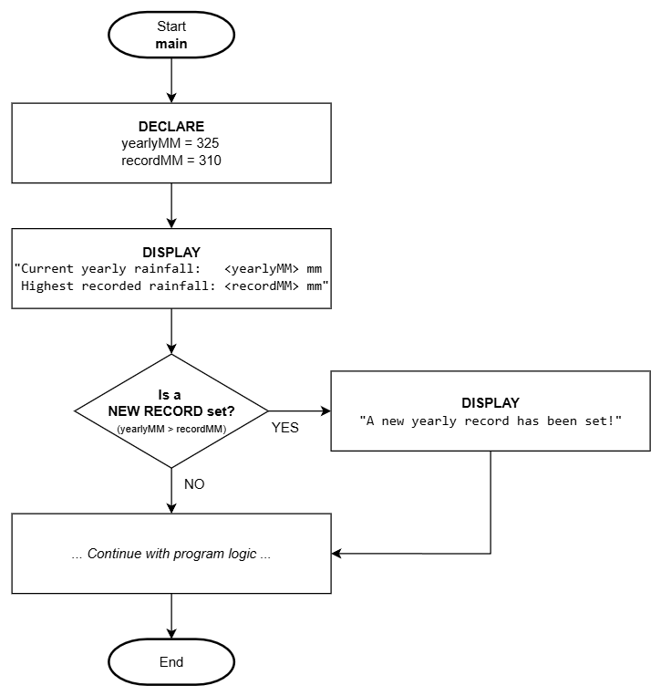
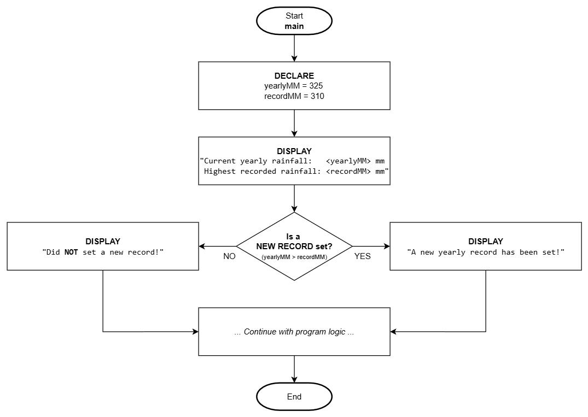
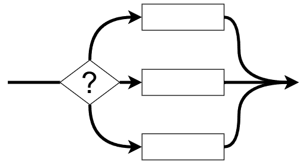
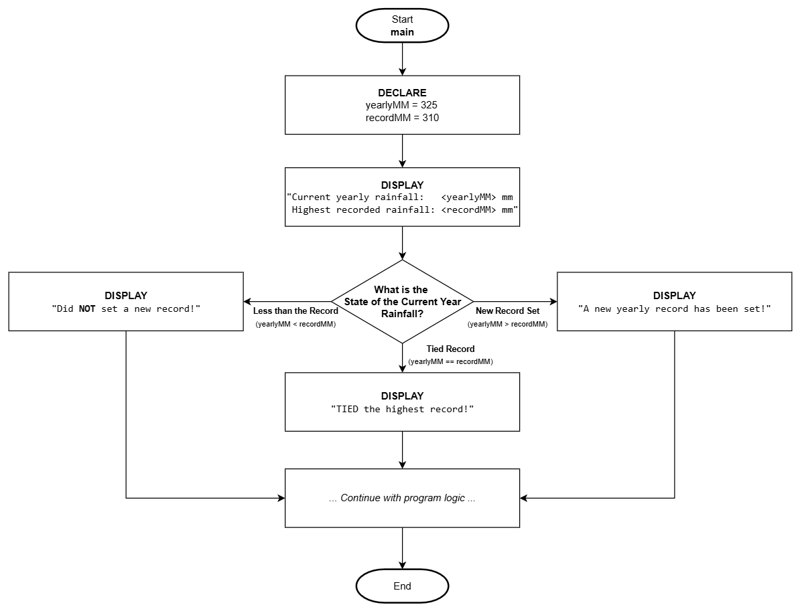

# Logic - Selection

## Overview

Computers programs are not very useful without the ability to adjust to changing conditions. For programs to react and change logical direction there needs to be a mechanism to allow changes to when specific logic should be executed and also when not to execute certain logic. The concept of **Selection** is what provides programs the ability to apply logical decisions which can alter the execution sequence. There are several variations of selection (especially when coding it in a computer language), however the main three logical flows will be examined here.

## Optional Selection


Optional selection provides a program the ability to execute **additional logic** to do something **only if one or more conditions are determined TRUE**, otherwise, the main program logic continues as normal.

Let's review part of a program where the total yearly rainfall is being evaluated to see if it has set a new record. The program should update the highest record only when the yearly rainfall amount is determined to be more than the last known record. The logic to update the record should only occur if the yearly rainfall has been determined to be greater than the last known record. If the yearly rainfall is 325 mm and the last known record is 310 mm, we should expect the logic to update the record to the new value, otherwise, do nothing (continue with the normal program logic).

Here is how it would be done in a flowchart:



:::caution NOTE

- Notice the **DIAMOND shape** for the **selection decision**.
- The question is using **concise non-technical language**.
- The technical part (optional) has less emphasis and is in smaller font.
- Something "extra" only occurs if it is evaluated to TRUE (yes).
  :::

Here is the pseudo code equivalent:

```
Function: main

1. DECLARE
      yearlyMM = 325
      recordMM = 310

2. DISPLAY:
      "Current yearly rainfall:   <yearlyMM> mm
       Highest recorded rainfall: <recordMM> mm"

3. Is yearlyMM > recordMM ?
      YES:
            a) ASSIGN: recordMM = yearlyMM
            b) DISPLAY:
                  "A new yearly record has been set!"

4. ... Continue with program logic ...
5. End
```

The program will **only (optionally)** update the record and display a message indicating a new record was set **if the current year's rainfall is higher** than the previous set record. The expression in **step #3 is "selection"** where a `TRUE` or `FALSE` condition is being evaluated and based on that determination, extra logic may be executed.

:::caution NOTE

- Notice the text 'label' `YES:` used to identify the answer to the selection question?
- Notice the logic indentation (`TAB`) consistency of the pseudo code?
- Notice how the enumeration changed from numbers (1...2...) to characters (a...b...) when the 'inner logic' is sequenced?

It is important to maintain easy to read logic in pseudo code especially when **nested statements are involved**.

The nested statements in this example is where the group of statements are placed under the `YES:` logic path.
:::

## Alternative Selection


Alternative selection is like a 'Y' in the road where **a decision must be made** and no matter what **only one of two different logic paths** will be executed but **not both**.

Continuing with the preceding example, the application will now display an outcome no matter what. **EITHER** a new rainfall record was set, **OR** a new record was NOT set.

Here is how it would be done in a flowchart:



And here is how it would be done in pseudo code:

```
Function: main

1. DECLARE
      yearlyMM = 325
      recordMM = 310

2. DISPLAY:
      "Current yearly rainfall:   <yearlyMM> mm
       Highest recorded rainfall: <recordMM> mm"

3. Is yearlyMM > recordMM ?
      YES:
            a) ASSIGN: recordMM = yearlyMM
            b) DISPLAY:
                  "A new yearly record has been set!"
      NO :
            a) DISPLAY:
                  "Did NOT set a new record!"

4. ... Continue with program logic ...
5. End
```

## Multiple Alternative Selection



Multiple alternative selection is like an 'E' in the road where **a decision must be made** and no matter what **only one** of **THREE or more** different logic paths will be executed but **not all**.

Continuing with the preceding example, the application will display an outcome no matter what for **only one** of these **three possibilities**:

1. A **new rainfall record** was set.
2. The current year rainfall **TIED** with the highest record.
3. A new record was **NOT set**.

Here is how it would be done in a flowchart:



And here is how it would be done in pseudo code:

```
Function: main

1. DECLARE
      yearlyMM = 325
      recordMM = 310

2. DISPLAY:
      "Current yearly rainfall:   <yearlyMM> mm
       Highest recorded rainfall: <recordMM> mm"

3. What is the state of the current year rainfall?
      NEW RECORD SET (yearlyMM > recordMM):
                  a) ASSIGN: recordMM = yearlyMM
                  b) DISPLAY:
                        "A new yearly record has been set!"

      TIED RECORD (yearlyMM == recordMM):
                  a) DISPLAY:
                        "TIED the highest record!"

      LESS THAN THE RECORD (yearlyMM < recordMM) :
                  a) DISPLAY:
                        "Did NOT set a new record!"

4. ... Continue with program logic ...
5. End
```

## Nesting Selection

Do an example where a selection is within another selection...

- Flowchart
- Pseudo Code
