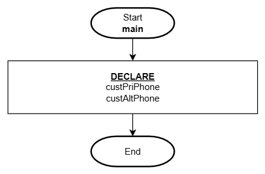
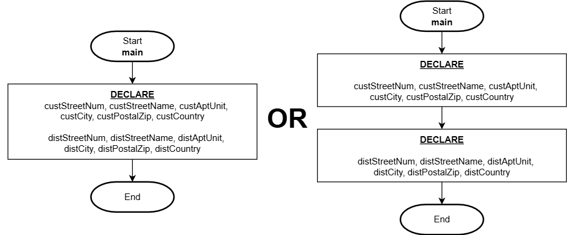
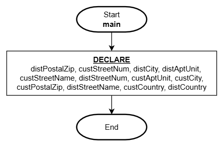

# Variables

## Overview

As introduced in the Computational Thinking: [Data Representation](./computational-thinking.md#data-representation) section, variables are named placeholders which can be referred to within the solution to access specific information by name to refer to a value.

Variables are critical in providing our solutions the ability to not just store, but use information to help determine logical pathways ([selection](./logic-selection.md) which is covered later). Information can be simple and straight forward, but it can also be very complex. The more complex data representation will be covered much later in these notes, but in this section we'll concentrate on simple data representation and how variables are used in both flowchart and pseudo code methods of documentation.

Many programming languages are "typed" in that you must indicate the type of information the variable must represent (example: whole number, fractional number, characters etc.), but not all languages require this extra level of detail. Sticking with the "language agnostic" theme, we will not be including type information when we declare and use variables.

## Terminology

| Term           | Meaning                                                       |
| -------------- | ------------------------------------------------------------- |
| **IDENTIFIER** | The **name** of the variable.                                 |
| **DECLARE**    | To **create** a variable which will include the IDENTIFIER.   |
| **ASSIGN**     | To **store a value** to a variable.                           |
| **INITIALIZE** | To both DECLARE and ASSIGN a value to a variable in one step. |

## Variable Identifiers (name)

Variable identifiers should be well thought out and purposefully named to best describe the information it will be representing. It is important to apply this to your actual programming as well! Providing meaningful names to your variables will contribute towards easier to read and manage logic (or code). However, we need to be mindful of efficiency as we don't want to be referring to very long names (and in the case of programming code, we don't want to be typing them either!), so we try to use a style of shorthand to shorten the names enough without losing the context.

For instance, if we need to represent information about a customer's primary phone number and an alternate phone number, we wouldn't want to be too descriptive:

```
DECLARE:
    customerPrimaryPhoneNumber
    customerAlternatePhoneNumber
```

We would instead shorten the words to abbreviations but not to the point where we still can't understand what they are:

**Pseudo Code**

```
1. DECLARE:
    custPriPhone
    custAltPhone

2. End
```

**Flowchart**



As you immerse yourself in this industry, you will continue to learn many typical shorthand naming conventions for various information. You will get better in time and practice!

Something you may have noticed is the use of upper and lower case characters to help discern between words. This is a common naming practice ("lower camel case" - [wikipedia](https://en.wikipedia.org/wiki/Camel_case)) in programming which we will be applying in these notes as well.

## Organization

Sometimes we need to manage a lot of information which can lead to the use of many variables. It is a standard practice to **group logically related variables together** and as needed, using a combination of lines and line-spacing. Grouping variables help readers find variables quickly and this helps confirm you have variables for all the data you will need representation for.

Scenario: A solution needs to represent address information for a **customer** and a **distributor**. How would you breakdown this information into appropriate variables?

**Pseudo Code**

```
1. DECLARE:
    custStreetNum, custStreetName, custAptUnit, custCity, custPostalZip, custCountry
    distStreetNum, distStreetName, distAptUnit, distCity, distPostalZip, distCountry

2. End
```

**Flowchart**



These variables are **grouped** by **customer** then by **distributor** and separating these two independent groups with a line break. Organizing the variables like this makes it super easy to find and confirm the data representation for each key piece of information.

:::danger DON'T DO THIS
What you don't want to do is declare every variable on a single line in random order! This is very confusing and benefits nobody:

**Pseudo Code**

```
1. DECLARE:
    distPostalZip, custStreetNum, distCity, distAptUnit, custStreetName, distStreetNum, custAptUnit, custCity, custPostalZip, distStreetName, custCountry, distCountry

2. End
```

**Flowchart**



:::
